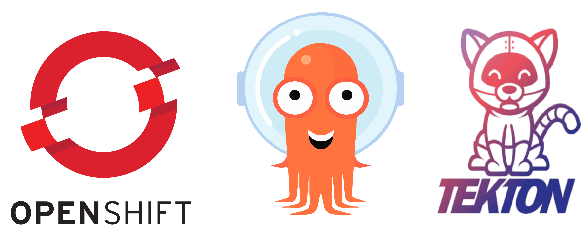

# NodeJS Deployment with Tekton-Pipeline & ArgoCD With Helm Chart #

## Prepare Work Enviourment ##
* Have Openshift 4.10 Platform
* Installed:
    Openshift Git-Ops Operator
    Openshift Pipeline Operator
* VScode

